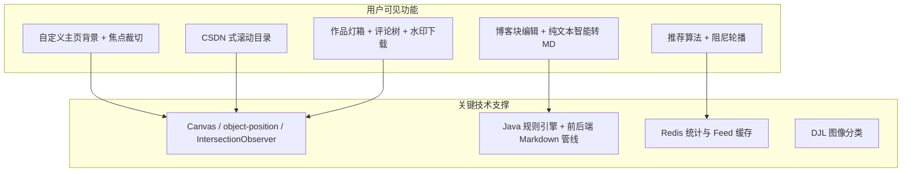

# 功能实现说明

> 项目：**Lensera** 影像社区  
> 本文档面向设计报告「系统功能与实现」章节，按页面/模块说明**具体功能**、**用户价值**与**关键技术**，并标注适合答辩时重点讲解的亮点。  
> 配套文档：[技术选型](./技术选型.md)

---

## 1. 系统功能总览

Lensera 围绕「**摄影作品展示 + 摄影博客社区**」两条主线，提供从封面引流、注册登录、作品上传与 AI 分类、博客创作与阅读、社交互动到个人品牌主页的完整闭环。

| 模块 | 主要页面/入口 | 核心能力 |
|------|----------------|----------|
| 品牌与引流 | 封面页 `/` | 动态背景、进入社区、联系与登录 |
| 用户体系 | 登录/注册、个人设置 | JWT、邮箱验证码、资料与封面定制 |
| 作品库 | `/editor/works` | 瀑布流、灯箱详情、评论、点赞、水印下载 |
| 博客 | `/editor/blog`、文章详情 | 块编辑器、智能转 Markdown、目录导航、评论 |
| 首页推荐 | `/editor/home` | Top 点赞轮播、精选分类、推荐作者博客 |
| 个人主页 | `/editor/user/:id` | 可定制背景、作品墙、博客列表 |
| 静态信息 | 关于 / 联系 | 团队介绍、版权与侵权说明 |

---

## 2. 个人主页顶部背景区（自定义图 + 沉浸式交互）⭐⭐⭐

> **本项目最具辨识度的交互之一**：类似主流 App 个人主页的「下拉展开封面」，在 Web 端用纯前端物理动画实现，并与用户自定义显示焦点深度结合。

### 2.1 页面视觉结构（对应截图）

个人主页顶部由多层叠加构成：

1. **背景图层**：用户上传的全宽摄影图（或默认占位图），`object-fit: cover` 铺满横幅。  
2. **渐变蒙层（Scrim）**：自底向上的黑色渐变，保证左下角 **头像、昵称、公开 ID** 在白/亮背景上仍清晰可读（如图「mmm / ID: 1000000」）。  
3. **浮层信息**：圆形头像 + 用户名 + 数字 ID，随下拉产生轻微视差与阴影变化。  
4. **其下资料区**：黑色底上的 **获赞 / 关注 / 粉丝** 三项统计 + **个人签名**（如「若不为昨日…」），与背景区在滚动逻辑上分离。

背景图显示中心由用户在「设置」中调整的 **焦点坐标（coverFocusX、coverFocusY）** 决定，收起与拉满两种状态共用同一锚点，避免展开时画面「跳变」。

### 2.2 资料设置：上传与「调整显示区域」

点击「设置」打开 `MineEditProfileModal`，可修改昵称、签名、头像、主页背景。

- 上传背景后弹出 `MineCoverCropModal`：**拖拽画面**即可改变显示锚点（非裁切像素文件，而是记录百分比焦点）。  
- 保存后写入数据库 `cover_focus_x / cover_focus_y`，并随 `PATCH /api/user/me` 提交。  
- 后端 `ProfileImageCompressor` 压缩背景图；存储路径 `users/{publicId}/background/{年}/{月}/`。

### 2.3 背景交互状态机（核心逻辑）

背景区在两种主状态间切换：

| 状态 | 用户感知 | 技术标记 |
|------|----------|----------|
| **收起（Folded）** | 常规横幅高度，约 200–300px + 视口比例自适应 | `heroPullPx ≈ 0` |
| **拉满（Locked）** | 封面扩展至主内容区约 **72% 视窗高度**，近似全屏沉浸 | `heroPullPx → pullMax`，`heroLocked = true` |
| **过渡（Pulling）** | 滚轮上拉过程中的连续拉伸 | `0 < heroPullPx < pullMax` |

**pullMax** 由 `ResizeObserver` 监听主滚动容器高度动态计算：`pullMax = 容器高度 × 0.72 − 基础横幅高度`，保证不同分辨率下「拉满」观感一致。

### 2.4 四种操作方式

**（1）顶部向上滚轮（过滚）**  
页面已在最顶部（`scrollTop = 0`）时，继续向上滚轮 → 阻止默认滚动，增加 `heroTarget` 拉动力度；接近上限时自动 **锁定拉满**。力度随当前 pull 增加而衰减（橡皮筋函数 `heroRubberFactor`），越拉越「沉」。

**（2）顶部向下滚轮（收回）**  
在顶部且背景处于展开/半展开时，向下滚轮 → 减少 pull，可退出锁定；松手后若未锁定，约 420ms 触发 **缓慢自动回弹**（`idleRetract` 每帧 ×0.965）。

**（3）触摸滑动**  
移动端在顶部：**手指下滑**等同向上拉背景，**手指上滑**等同收回；与滚轮共用同一套目标值与动画循环。

**（4）点击背景区域**  
横幅上透明热区 `mine-hero-cover-hit`：  
- 收起态 → **一键展开**（约 1.68s，`easeOutQuint` 缓动）；  
- 拉满态 → **一键收起**。  
展开/收起动画期间禁用重复点击，并提升显示层跟随速度以保证丝滑。

**（5）页面滚动离开顶部**  
一旦主区域 `scrollTop > 10px`，自动 **清零** 背景拉伸状态，避免下方浏览作品/博客时顶部仍占满屏。

打开上传弹窗、设置弹窗或裁切弹窗时，**暂停**所有背景过滚逻辑，并锁定页面滚动，防止手势冲突。

### 2.5 动画与视差（技术亮点）

采用 **`requestAnimationFrame` 物理循环**，而非 CSS transition 硬切换：

- **目标值 `heroTarget`**：由滚轮/触摸/点击瞬间改变。  
- **显示值 `heroDisplay`**：每帧按 `1 - exp(-ω·Δt)` 向目标逼近（ω≈16，跟手且平滑）。  
- **渲染变量 `heroPullPx`**：驱动 CSS 变量 `--mine-hero-pull`，使横幅 **min-height = 基础高度 + pull**。

**多层视差（`computeHeroParallax`）** 随 pull 连续变化：

- 背景图：轻微 **scale（最大约 +6.2%）** + 向上平移；  
- 底部蒙层：高度与透明度插值（拉满时蒙层变淡，露出更多画面）；  
- 头像与昵称浮层：反向微移 + 略缩小 + 文字阴影减弱。

蒙层样式 `computeHeroScrimStyle` 用 smoothstep 插值，**避免 CSS 类名切换导致的一帧卡顿**。

系统尊重 **`prefers-reduced-motion`**：用户开启减少动画时，点击展开/收起改为瞬时切换，不做弹簧过渡。

### 2.6 技术实现要点汇总

| 环节 | 实现 |
|------|------|
| 主文件 | `cover/src/Mine.jsx`（交互）、`Mine.css`（分层样式） |
| 焦点工具 | `utils/coverFocus.js` → `object-position: x% y%` |
| 裁切弹窗 | `MineCoverCropModal.jsx` 指针拖拽焦点 |
| 布局测量 | `computeHeroLayoutMetrics` + `ResizeObserver` on `.editor-content` |
| 滚动容器 | 绑定 editor 主内容区滚轮，而非 window |
| 后端 | `tb_user.cover_focus_x/y`、背景文件 URL |

### 2.7 答辩亮点话术（建议重点讲 1～2 分钟）

> 「个人主页顶部不是一张死图，而是 **可定制焦点 + 可交互展开的沉浸式封面**。用户先在设置里拖拽决定背景『看哪里』，回到主页后，在顶部继续上拉或点一下，封面会丝滑拉到接近全屏，头像和昵称跟着做视差；再点或往下滚就收回。底层是我们自写的弹簧跟踪和橡皮筋阻力，没有用现成轮播组件，这是 Lensera 最有记忆点的体验之一。」

---

## 3. 撰写博客（Markdown 编辑 + 文档智能转 Markdown）⭐⭐

### 3.1 功能描述

`MineBlogPublishModal` 采用**三栏布局**（如图所示）：

1. **左侧 · 文章设置**：分类、标签、摘要、16:9 **列表封面**上传  
2. **中间 · 正文编辑**：`BlogBlockEditor` 块编辑器，支持标题 H1–H3、段落、列表、引用、图片块；快捷键 `Ctrl+Enter` 切换块类型  
3. **右侧 · MD 转换**：`BlogMdConvertPanel` —— 用户从 Word / 记事本 / AI 输出粘贴**纯文本**，一键「预览转换」后「应用到正文」

**智能转 Markdown（后端）** `PlainTextToMarkdownService` 识别：

- 已有 Markdown 语法（`#` 标题、`>` 引用、`-` 列表等）  
- 中文章节：`第一章`、`一、`、`1.` 等 → 映射为 `#` / `##` / `###`  
- 段落合并、行内 `【强调】`、`*斜体*` 等润色  

前端 `blocksToMarkdown` / `markdownToBlocks`（`blockEditorModel.js`）在块结构与 Markdown 字符串间双向转换；发布时 `bodyMarkdown` 写入 `tb_blog_post.body_markdown`，内嵌图走 `POST /api/blog-posts/assets`。

### 3.2 技术实现要点

| 环节 | 实现 |
|------|------|
| 转换 API | `POST /api/blog-posts/convert-markdown`，请求体 JSON，返回 Markdown 字符串 |
| 规则引擎 | Java 多模式 `Pattern` 逐行扫描 + 段落缓冲 `flushParagraph` |
| 安全限制 | 单次转换最长 20 万字，防止滥用 |
| 编辑器 | 自研块模型，非重量级富文本 iframe，便于与 MD 管线对齐 |
| 存储 | 封面与正文图分目录；详见 [blog-storage-architecture](../springboot_photo/docs/blog-storage-architecture.md) |

### 3.3 答辩亮点话术

> 「很多用户已有 Word 或 AI 生成的文稿，我们提供**右侧智能转换栏**：后端用中文友好的结构识别规则转 Markdown，前端再拆成块编辑，降低从 CSDN/知乎迁移内容的门槛——这是区别于普通 textarea 的核心体验。」

---

## 4. 博客阅读页（CSDN 同款滚动目录 + Markdown 渲染）⭐⭐

### 4.1 功能描述

博客详情（`BlogArticleView.jsx` + `ApiBlogDetail.jsx`）展示：

- 分类标签、标题、摘要、作者、日期、**阅读数**、预估阅读时长  
- 正文：Markdown → HTML（`simpleMarkdownHtml.js` / `markdownArticle.js`），标题带 `id` 锚点  
- 右侧固定 **「目录」** 组件 `BlogArticleOutline`：  
  - 自动从正文提取 `#` / `##` / `###`（`parseMarkdownOutline`）  
  - **滚动高亮**：`IntersectionObserver` 监听标题进入视口，目录项同步 `is-active`  
  - 点击目录项 `scrollIntoView({ behavior: 'smooth' })`  
  - 支持**收起/展开**目录栏  
- 文末 **评论区分** `BlogCommentsPanel`：树形回复、点赞、登录校验  

阅读计数：用户打开文章时 `POST /api/blog-posts/{id}/view`，后端 Redis 去重（登录用户 / IP 哈希）+ 定时落库 MySQL（`BlogStatsRedisService`）。

### 4.2 技术实现要点

| 环节 | 实现 |
|------|------|
| 目录数据 | 前端解析 Markdown 标题，生成稳定 `id`（中文 slug + 去重序号） |
| 滚动监听 | `IntersectionObserver`，`root` 为 `.editor-content`，`rootMargin` 优化激活区间 |
| 样式 | `BlogArticle.css` 中 `.blog-article-outline` 粘性侧栏，多级缩进 |
| 阅读统计 | Redis `blog:stats:view:*` + `BlogStatsFlushScheduler` 异步 flush |

### 4.3 答辩亮点话术

> 「长文技术博客没有目录很难读。我们实现了与 **CSDN 类似的右侧目录 + 滚动spy**：纯前端 Observer，无需额外后端接口，标题与正文锚点同源生成，保证跳转准确。」

---

## 5. 作品详情灯箱（评论、点赞、编辑、水印下载）⭐⭐

### 5.1 功能描述

在作品库或个人主页点击作品进入 `WorksLightbox`：

- **左侧大图**：按容器与图片比例自动选择「宽占满」或「高占满」（`computeLightboxFit` + `ResizeObserver`）  
- **右侧信息栏**：分类、标题、作者、说明、**评论列表**（`WorkCommentsPanel`）  
- **底部操作栏**：  
  - 点赞（心形 + 计数，调用 `/api/works/{id}/like`）  
  - 作者可见：编辑、删除  
  - **下载**：带 **Lensera** 品牌水印的本地保存  

评论支持：发表、回复、点赞评论、相对时间显示；作品评论 API `/api/works/{workId}/comments`。

### 5.2 水印下载功能 ⭐

`downloadWorkWithWatermark.js` 流程：

1. 通过 Axios `responseType: 'blob'` 拉取原图（同源 `/files/**`，避免 Canvas 跨域污染）  
2. `createImageBitmap` + **Canvas 2D** 绘制原图  
3. 右下角绘制半透明底 + **「Lensera」** 文字（字号随图自适应）  
4. `canvas.toBlob` 导出 JPEG/PNG，触发浏览器下载  

文件名：`{标题}-lensera.jpg`，体现品牌传播与版权宣示。

### 5.3 技术实现要点

| 环节 | 实现 |
|------|------|
| 灯箱布局 | CSS Grid 左右分栏；`Works.css` 响应式下改为上下堆叠 |
| 评论 | 后端树形 `WorkComment` + `WorkCommentService`；前端递归渲染 |
| 下载 | 纯前端 Canvas，不增加服务器算力；适合大赛演示「版权保护」 |
| 深度链接 | `/editor/works?work={id}` 自动打开对应作品灯箱 |

### 5.4 答辩亮点话术

> 「摄影作品社区必须考虑**版权**。我们在详情页提供一键下载，并在客户端合成 **Lensera 水印**——既方便用户保存欣赏，又明确平台品牌与传播边界。」

---

## 6. 首页与博客推荐（数据驱动 + 交互）⭐

### 6.1 首页轮播 Banner

- 从全站作品流按 **点赞数 Top5** 取图（`buildBannerSlidesFromFeed.js`）  
- `HomeBannerCarousel`：3 秒自动轮播、悬停暂停、左右极简箭头、底部圆点  
- 「探索作品」跳转当前幻灯片对应作品（`/editor/works?work=id`）

### 6.2 推荐作者博客（算法 + 阻尼轮播）

**Top3 作者算法**（`buildFeaturedAuthors.js`）：

\[
S = V_{\text{blog}} + L_{\text{works}} + C_{\text{comments}}
\]

约束：至少 **2 篇**已发布博客；每作者展示其 **最新 2 篇**。

- 首页：`HomeFeaturedBlogSection` — 竖向三槽，`useDampedSlotCarousel` + `dampedSpring.js` 滚轮切换  
- 博客页：`BlogHeroAuthorCarousel` — 横向三槽，滚轮向下 → 槽位向右  

### 6.3 精选作品五分类

`homeFeaturedWorks.js`：每类（风景/人物/动物/街拍/静物）按  
\(S = \alpha \cdot H_{\text{likes}} + (1-\alpha) \cdot R_{\text{time}}\)  
选取封面（α=0.6，时间半衰期 30 天）。

### 6.4 技术要点

| 能力 | 技术 |
|------|------|
| Feed 性能 | Redis 缓存作品流 JSON（`WorksFeedRedisCache`，版本号失效） |
| 流畅切换 | 自研阻尼弹簧动画，按槽位高度/宽度测量步进 |
| 数据一致 | 统一 `fetchWorksFeed` / `fetchBlogFeed` 接口 |

---

## 7. 其他重要功能（简述）

### 7.1 作品上传与 AI 分类

- 多图上传、Thumbnailator 压缩、缩略图  
- 可选 **DJL + ResNet18** 异步推理（`WorkImageClassificationService`），映射风景/人物/动物等粗类  
- 用户可选手动分类或 `aiClassify=true`

### 7.2 用户与社交

- 注册登录、邮箱验证码（QQ SMTP + Redis OTP）  
- 关注 `/api/users/{publicId}/follow`  
- 个人主页访客/本人双模式（`Mine.jsx`）

### 7.3 博客管理

- 个人主页博客 Tab：**已发表 / 草稿箱** 筛选（`MineBlogPanel`）  
- 状态：草稿 / 待审 / 已发布 / 已驳回  

### 7.4 封面与品牌页

- 封面页 LiquidChrome（**ogl** WebGL 着色器）动态背景  
- 关于我们 / 联系我们（团队 Logo、版权与侵权下架流程）

---

## 8. 功能—技术对照表（报告附录可用）

| 功能 | 用户感知 | 前端 | 后端/中间件 |
|------|----------|------|-------------|
| 自定义主页背景 | 拖拽选显示区域 | `MineCoverCropModal`、`coverFocus.js` | 焦点字段 + 文件存储 |
| 背景沉浸交互（核心） | 过滚拉满/点击展开/视差蒙层 | `Mine.jsx` 弹簧 rAF + `computeHeroParallax` | — |
| 纯文本转 Markdown | 粘贴 Word/AI 文稿一键转换 | `BlogMdConvertPanel` | `PlainTextToMarkdownService` |
| 块编辑器 + MD | 类 Notion 块、可插图 | `BlogBlockEditor`、`blockEditorModel` | `body_markdown`、assets API |
| CSDN 目录 | 右侧目录随滚动高亮 | `BlogArticleOutline`、`IntersectionObserver` | 阅读数 Redis |
| 博客评论 | 回复、点赞 | `BlogCommentsPanel` | `BlogCommentService` |
| 作品评论 | 侧栏评论 | `WorkCommentsPanel` | `WorkCommentService` |
| 水印下载 | 下载带 Lensera 水印 | Canvas + Axios Blob | 静态文件 `/files/**` |
| 作品灯箱适配 | 横竖图均完整展示 | `computeLightboxFit` | — |
| 推荐作者 | 首页/博客 Top3 | `buildFeaturedAuthors`、阻尼轮播 | Feed + 统计聚合 |
| 首页轮播 | Top5 热图 | `HomeBannerCarousel` | `likeCount` 排序 |
| 作品流加速 | 列表更流畅 | 缓存命中时秒开 | Redis Feed 缓存 |
| AI 分类 | 自动打标签 | 上传后刷新可见 | DJL 异步线程池 |

---

## 9. 建议答辩演示顺序（约 8–10 分钟）

1. **封面 → 登录 → 首页**（轮播 + 推荐作者滚轮切换）  
2. **作品库 → 点开灯箱**（评论 + **水印下载**）  
3. **撰写博客**（右侧粘贴纯文本 → 转换 → 应用到正文 → 发布）  
4. **打开刚发布的文章**（展示 **目录滚动高亮** + 评论）  
5. **个人主页**（⭐ 顶部上拉/点击展开背景 → 设置里调整显示焦点 → 视差与蒙层）  
6. （可选）上传作品触发 **AI 分类** 标签  

---

## 10. 相关源码索引

| 功能 | 主要文件 |
|------|----------|
| 资料与背景 | `cover/src/MineEditProfileModal.jsx`、`MineCoverCropModal.jsx`、`Mine.jsx` |
| 博客发布 | `cover/src/MineBlogPublishModal.jsx`、`BlogMdConvertPanel.jsx`、`BlogBlockEditor.jsx` |
| MD 转换服务 | `springboot_photo/.../PlainTextToMarkdownService.java` |
| 文章阅读 | `cover/src/BlogArticleView.jsx`、`BlogArticleOutline.jsx`、`utils/markdownArticle.js` |
| 作品灯箱 | `cover/src/WorksLightbox.jsx`、`Works.jsx` |
| 水印下载 | `cover/src/utils/downloadWorkWithWatermark.js` |
| 推荐算法 | `cover/src/utils/buildFeaturedAuthors.js`、`hooks/useDampedSlotCarousel.js` |
| 阅读统计 | `springboot_photo/.../BlogStatsRedisService.java` |

---

*文档版本与仓库实现同步；若功能迭代，请以实际代码为准。*
