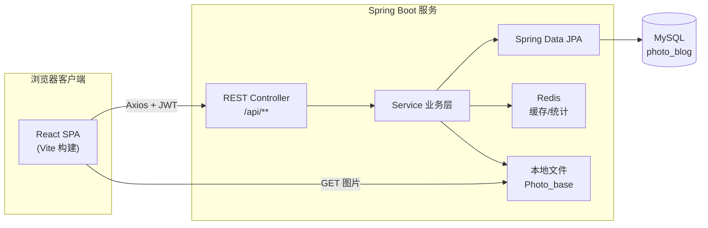

# 技术选型

> 项目：**Lensera** 影像社区（第十九届计算机设计大赛）  
> 代码仓库：`cover`（前端）+ `springboot_photo`（后端）+ `Photo_base`（静态资源）

---

## 1. 总体架构与设计理念

本项目 **Lensera** 采用典型的 **B/S（Browser/Server）架构** 与 **前后端分离** 模式：浏览器端为单页应用（SPA），业务逻辑与持久化由独立的后端服务承担，二者通过 **RESTful HTTP API** 以 **JSON**（文件上传为 **multipart/form-data**）交互。

| 层次 | 实现 | 说明 |
|------|------|------|
| 表现层 | `cover`（React + Vite） | 封面、登录注册、作品库、博客、个人主页等 |
| 业务与接口层 | `springboot_photo`（Spring Boot） | 统一 `/api/**` 接口、鉴权、业务编排 |
| 数据层 | MySQL + JPA | 用户、作品、博客、评论、关注等结构化数据 |
| 缓存与热数据 | Redis | 作品流缓存、博客阅读/评论点赞聚合 |
| 静态资源 | 本地文件系统 `Photo_base` | 作品图、头像、博客封面与正文插图，经 `/files/**` 对外提供 |

开发环境下，前端由 **Vite 开发服务器**（默认 `http://localhost:5173`）提供页面与热更新；后端 **Spring Boot 内嵌 Tomcat** 监听 **8080**，通过 `WebMvcConfig` 配置 **CORS**，允许前端跨域访问 `/api/**` 与 `/files/**`，从而实现联调与部署解耦。

**选型原则概括：**

- **前后端分离**：便于团队分工、界面快速迭代，后端接口可被多端复用。
- **主流开源栈**：Spring 生态 + React 生态，文档与社区成熟，利于大赛演示与后续维护。
- **适度引入中间件**：Redis 缓解高频列表与计数压力，避免为简单场景过早引入消息队列等重型组件。
- **本地文件 + URL 映射**：摄影类应用以图片为主，采用可配置的 `app.upload.root` 与 `/files/**` 静态映射，降低对象存储接入成本，同时保留向 OSS/CDN 迁移的路径（仅需替换 `app.public-base-url` 与存储实现）。

---

## 2. 前端技术选型

### 2.1 核心框架与工程化

| 技术 | 版本（package.json） | 选型理由 |
|------|----------------------|----------|
| **React** | 19.x | 组件化开发，适合复杂交互（灯箱、轮播、博客编辑器等） |
| **React DOM** | 19.x | 与 React 配套的渲染层 |
| **Vite** | 8.x | 基于 ESM 的 dev server 与生产构建，冷启动与 HMR 快，适合比赛周期内频繁改 UI |
| **@vitejs/plugin-react** | 6.x | 官方 React 插件，支持 JSX 与 Fast Refresh |
| **ESLint** | 9.x | 静态检查，配合 React Hooks 规则保证代码质量 |

项目入口为 `main.jsx` + `App.jsx`，使用 **`react-router-dom` 7.x** 做客户端路由，划分封面（`/`）、认证（`/login`、`/register`）与后台壳层（`/editor/*`）三大区域。

### 2.2 路由与页面组织

- **封面页** `CoverPage.jsx`：品牌展示、LiquidChrome 动态背景（`ogl` WebGL）、跳转首页/联系/登录。
- **编辑器布局** `HomeEditor.jsx`：左侧 FlowingMenu 导航 + `Outlet` 子路由（首页、作品、博客、关于、联系、个人主页）。
- **业务页面**：`Home.jsx`（轮播 Banner + 精选作品 + 推荐博客）、`Works.jsx`（瀑布流 + 灯箱详情）、`Blog.jsx` / `BlogArticleView.jsx`、`Mine.jsx`（个人主页、作品 Tilt 展示、博客发布）等。

路由与页面拆分使 **功能模块边界清晰**，符合 SPA 可维护性要求。

### 2.3 网络通信与状态

| 技术 | 用途 |
|------|------|
| **Axios** 1.15.x | 封装 `api/client.js` 统一 `baseURL`（开发指向 `http://localhost:8080`）、超时、请求拦截 |
| **JWT（Bearer）** | 登录后将 token 存入 `localStorage`，拦截器自动附加 `Authorization` 头 |
| **FormData** | 作品/博客/头像等多媒体上传；拦截器对 FormData 删除默认 `Content-Type`，由浏览器生成 boundary |

API 按领域拆分为 `api/auth.js`、`works.js`、`blogs.js`、`blogComments.js`、`workComments.js`、`users.js`、`profile.js` 等，与后端 Controller 一一对应，避免单文件膨胀。

业务状态以 **React Hooks（useState / useEffect / useMemo / useCallback）** 为主，未引入 Redux 等全局状态库——在当前页面规模下，**组件内状态 + 路由参数 + 接口刷新** 即可满足需求，降低学习与样板代码成本。

### 2.4 UI 与交互增强库

| 库 | 应用场景 |
|----|----------|
| **@primer/react** | 博客等页面的 GitHub Primer 设计系统组件（Button、Label、ThemeProvider 等），保证表单与状态标签风格统一 |
| **GSAP** | 动画时间轴（如导航、过渡效果） |
| **ogl** | 封面页 `LiquidChrome` 流体金属质感背景 |
| **react-parallax-tilt** | 个人主页作品卡片 3D 倾斜悬停（`TiltWorksPanel`） |
| **自研 `dampedSpring.js` + `useDampedSlotCarousel`** | 首页/博客推荐区滚轮切换作者的阻尼弹簧动画，提升交互品质 |

样式以 **原生 CSS 模块文件**（`Home.css`、`Works.css`、`Blog.css`、`Mine.css` 等）为主，深色摄影社区视觉统一，未强制 Tailwind，便于设计赛作品风格把控。

### 2.5 前端特色能力（与后端配合）

- **作品灯箱** `WorksLightbox.jsx`：大图适配（宽/高占满策略）、评论侧栏、点赞；**Canvas 水印下载**（`downloadWorkWithWatermark.js`，水印文案 **Lensera**）。
- **博客**：块编辑器 `BlogBlockEditor`、Markdown 转换面板、纯文本转 Markdown 调用后端 `/api/blog-posts/convert-markdown`。
- **推荐算法（前端聚合）**：`buildFeaturedAuthors.js`、`buildBannerSlidesFromFeed.js`、`homeFeaturedWorks.js` 等，基于 feed 接口数据做 Top 作者、轮播 Top5 点赞作品、分类精选封面等，减轻后端排序接口数量。

---

## 3. 后端技术选型

### 3.1 基础框架与运行环境

| 技术 | 版本 | 说明 |
|------|------|------|
| **Java** | 17（`pom.xml` `java.version`） | LTS 版本，支持现代语法与 Spring Boot 4 要求 |
| **Spring Boot** | 4.0.6 | 统一依赖管理、自动配置、内嵌 Tomcat |
| **spring-boot-starter-web** | 随 Boot | Spring MVC + JSON 序列化（Jackson） |
| **spring-boot-starter-validation** | 随 Boot | `@Valid` 请求体验证（注册、登录、发帖等） |
| **Maven** | 项目构建 | `spring-boot-maven-plugin` 打包可执行 JAR |

应用主类 `SpringbootPhotoApplication`，采用经典 **Controller → Service → Repository** 三层结构，DTO（`pojo.dto`）与实体（`pojo`）分离，接口统一包装为 `ResponseMessage<T>`。

### 3.2 数据访问与数据库

| 技术 | 说明 |
|------|------|
| **MySQL** | 库名 `photo_blog`，连接串配置于 `application.properties`（`utf8`、`Asia/Shanghai` 时区） |
| **Spring Data JPA** | `spring-boot-starter-data-jpa`，实体映射表如 `tb_user`、`tb_work`、`tb_blog_post`、`tb_work_comment`、`tb_blog_comment`、`tb_user_follow` 等 |
| **Hibernate** | `ddl-auto=update` 便于开发阶段表结构演进；生产环境建议改为显式迁移脚本 |
| **Repository 接口** | `repostity` 包下 JPA Repository + 部分 `@Query` 聚合（如用户获赞总数） |

**选型理由：** 社区类业务关系明确（用户-作品-点赞-评论-关注），关系型数据库保证事务与一致性；JPA 减少样板 SQL，适合快速实现 CRUD 与分页扩展。

### 3.3 安全与认证

本项目 **未引入完整 Spring Security 过滤器链**，而是采用 **轻量级 JWT 无状态认证**：

| 组件 | 作用 |
|------|------|
| **JJWT 0.12.5** | HS256 签发/解析 token（`JwtUtil`） |
| **spring-security-crypto** | `BCryptPasswordEncoder` 密码哈希（`SecurityCryptoConfig`） |
| **Controller 内校验** | 各需登录接口从 `Authorization: Bearer` 解析 `userId`，失败返回业务错误码 |

同时支持：

- 用户名密码注册/登录（`AuthController` `/api/auth/register`、`/login`）
- **邮箱验证码登录**（`spring-boot-starter-mail` + QQ SMTP，`EmailOtpService`）

**选型理由：** 大赛项目以功能完备为主，JWT 实现简单、与 SPA 契合；后续可升级为 Spring Security + OAuth2 而不影响现有 API 路径设计。

### 3.4 文件上传与图像处理

| 技术 | 作用 |
|------|------|
| **Multipart 上传** | `spring.servlet.multipart` 限制单文件 15MB、请求 20MB |
| **Thumbnailator 0.4.20** | 作品列表缩略图、上传图最长边压缩（如 1920px JPEG 质量约 0.85） |
| **ProfileImageCompressor 等工具类** | 头像、博客封面、内嵌图分级压缩策略 |
| **WebMvcConfig 资源映射** | `/files/**` → `app.upload.root`（默认指向 `Photo_base` 目录树） |

目录规范见 `UserUploadPaths` 与文档 `springboot_photo/docs/blog-storage-architecture.md`：`users/{publicId}/works|avatar|background|blog/...`，文件名含时间戳与 UUID，避免冲突。

### 3.5 人工智能 / 图像分类（增值能力）

| 技术 | 说明 |
|------|------|
| **Deep Java Library（DJL）0.27** | `pytorch-engine` + **ResNet18**（ImageNet）对上传作品可选 AI 分类 |
| **OnnxRuntime Engine**（可选） | 配置 `app.cv.onnx-model-url` 时可切换 ONNX 模型 |
| **AsyncConfig** | 独立线程池 `cvTaskExecutor`，`app.cv.async=true` 时异步写回分类标签，不阻塞上传响应 |

AI 结果映射为平台六大粗类（动物/人像/风景/街景/静物/其他），规则文件位于 `cv/coarse/` 与 `synset_coarse_override.properties`。

**选型理由：** 体现「计算机设计」中 **AI 与垂直场景结合**；DJL 可在纯 Java 后端完成推理，无需单独部署 Python 服务，降低部署复杂度。

### 3.6 邮件服务

- **spring-boot-starter-mail** + **QQ SMTP（SSL 465）**
- 敏感配置（授权码）放在 `application-local.properties`，通过 `spring.config.import` 可选加载，避免密钥进入版本库。

用于注册/登录验证码、后续可扩展通知类邮件。

---

## 4. 中间件：Redis

| 配置项 | 默认行为 | 业务用途 |
|--------|----------|----------|
| `spring-boot-starter-data-redis` | host/port 可环境变量覆盖 | 统一 Redis 访问 |
| `app.redis.feed-cache-enabled` | true | **作品流** `/api/works/feed` JSON 缓存，版本号 + TTL（120s），点赞/上传后 `bumpVersion` 失效 |
| `app.redis.blog-stats-enabled` | true | **博客阅读数** 去重计数（登录用户/IP 哈希）、**评论点赞** 热数据；定时任务 `BlogStatsFlushScheduler` 落库 MySQL |

**选型理由：**

- 作品流与首页/博客推荐多次拉取相同 feed，缓存可显著降低数据库 JOIN 与组装 DTO 压力。
- 阅读/点赞属于 **高频写、可最终一致** 场景，Redis 缓冲 + 周期 flush 是常见折中。
- Redis 可通过配置关闭（`feed-cache-enabled: false` 并排除自动配置），保证无 Redis 环境仍可演示核心功能。

---

## 5. 接口设计风格与前后端协作

- **风格**：REST，资源名复数（`/api/works`、`/api/blog-posts`），子资源表达评论与点赞（`/comments`、`/like`）。
- **响应格式**：统一 `{ code, message, data }`（`ResponseMessage`），前端 Axios 解包 `data`。
- **鉴权**：写操作与「我的」列表需 JWT；公开 feed、已发布博客、用户公开主页等可读接口按需匿名或可选 token（如 `likedByMe`）。
- **跨域**：开发期 CORS 白名单 Vite 源；生产需改为实际前端域名。
- **静态资源**：图片 URL 由后端拼接 `app.public-base-url` + `/files/相对路径`，前端直接 `` 或灯箱加载；下载水印在前端 Canvas 合成，减轻服务端算力。

主要 API 域（与代码一致）：

| 模块 | 路径前缀 | 说明 |
|------|----------|------|
| 认证 | `/api/auth/*` | 注册、登录、邮箱验证码 |
| 用户 | `/api/user/me`、`/api/users/{publicId}` | 资料、关注 |
| 作品 | `/api/works`、`/api/works/feed` | CRUD、流、点赞、评论 |
| 博客 | `/api/blog-posts` | CRUD、feed、Markdown 转换、评论、浏览计数 |

---

## 6. 开发与部署相关选型

| 类别 | 选型 |
|------|------|
| 前端开发服务器 | `npm run dev` → Vite，端口 5173 |
| 后端运行 | `mvn spring-boot:run` 或 IDE 运行 JAR，端口 8080 |
| 数据库 | 本地 MySQL 5.7/8.0 |
| 缓存 | 本地 Redis（可选） |
| 编码 | 全项目 UTF-8；YAML 配置中文路径避免 properties 乱码 |
| 前端生产构建 | `npm run build` 输出静态资源，可挂 Nginx；API 反向代理至后端 |

当前为 **开发一体化配置**（硬编码 `localhost`），生产环境可通过环境变量切换 `baseURL`、数据源、Redis、上传根目录与 `public-base-url`。

---

## 7. 技术选型总结

| 维度 | 选用方案 | 在本项目中的体现 |
|------|----------|------------------|
| 架构模式 | 前后端分离 B/S + REST | `cover` + `springboot_photo`，职责清晰 |
| 前端 | React 19 + Vite 8 + React Router 7 | SPA、多模块页面、丰富交互 |
| 后端 | Spring Boot 4 + Java 17 | 统一 API、事务、上传、定时任务 |
| 持久化 | MySQL + JPA | 用户/作品/博客/社交关系 |
| 缓存 | Redis | 作品流缓存、博客统计热数据 |
| 存储 | 本地文件系统 | 摄影作品集、博客 Markdown 插图 |
| 安全 | JWT + BCrypt + 邮箱 OTP | 登录注册与个人操作保护 |
| 多媒体 | Thumbnailator + 前端 Canvas | 压缩上传、水印下载 |
| 智能 | DJL PyTorch ResNet18 | 可选 AI 分类标签 |
| 通信 | HTTP/JSON + Multipart | Axios 客户端，CORS 联调 |

整体技术栈 **以成熟开源组件为主、避免过度工程化**，在有限开发周期内实现了 **作品社区、博客、评论点赞、关注、推荐展示、AI 分类、版权联系页** 等完整闭环，并预留 Redis 开关、ONNX 模型、静态资源 CDN 化等扩展点，适合作为计算机设计大赛作品中 **「可演示、可讲解、可演进」** 的技术方案说明。

---

## 相关文档

- [功能实现说明](./功能实现.md)（各页面功能、亮点与技术对照）
- [博客存储架构](../springboot_photo/docs/blog-storage-architecture.md)
